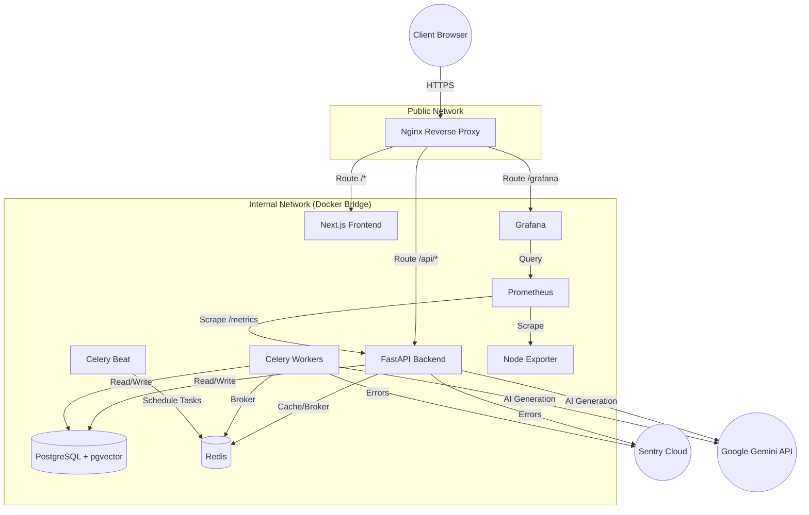

# SupportDesk AI Architecture

This document describes the high-level architecture of the SupportDesk AI platform in a production deployment.

## System Diagram

## Component Overview

1. **Nginx Reverse Proxy**: The single entry point for all traffic. Handles TLS termination, gzip compression, rate limiting, and routing traffic to the frontend, backend, or Grafana based on the URL path.
2. **Next.js Frontend**: Serves the React UI. Contains both the Admin Portal and the Customer Portal. Talks directly to the Backend API via Nginx.
3. **FastAPI Backend**: The core API server. Handles authentication, business logic, authorization (RBAC), and serves data.
4. **Celery Workers**: Background job processors. Handles heavy tasks like document vectorization, routing engine execution, and AI summarization.
5. **Celery Beat**: Scheduler for recurring tasks (e.g., ticket SLA breach checks).
6. **PostgreSQL**: The primary relational database. Uses the `pgvector` extension for storing vector embeddings.
7. **Redis**: Used for caching (e.g., RBAC permissions) and as the message broker for Celery.
8. **Prometheus & Grafana**: The observability stack. Prometheus scrapes metrics from the backend and host machine. Grafana visualizes these metrics.
9. **Sentry**: External error tracking service for capturing unhandled exceptions and performance traces.
